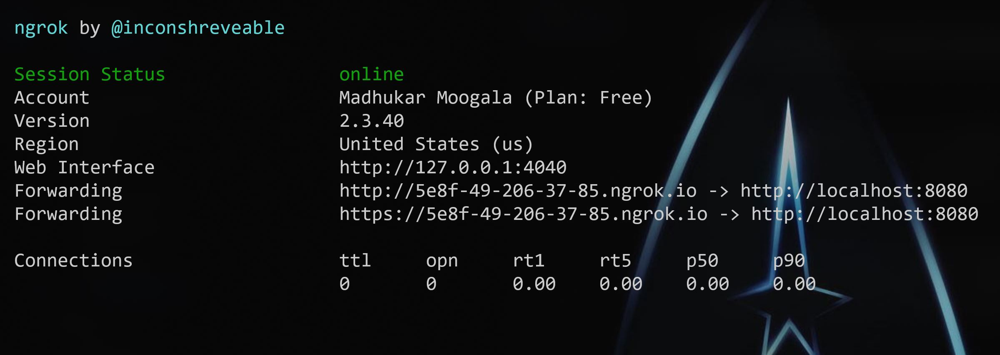

# APS Design Automation

[](https://nodejs.org/)
[](https://www.npmjs.com/)

[](http://opensource.org/licenses/MIT)

[](http://developer.autodesk.com/)
[](http://developer.autodesk.com/)
[](http://developer.autodesk.com/)


## Description

Webapp interface that uses Design Automation to update the `width` and `height` param of DWG Dynamic Block (using AutoCAD), RVT Window Family instance (using Revit), IPT Part parameters (using Inventor) and 3DS ... (using 3dsMax). Also includes a `Clear Account` (remove all AppBundles and Activities) and `Define new Activity` based on the sample code.

See other projects for bundles.

## Thumbnail

https://user-images.githubusercontent.com/6602398/204223085-41b11c3d-0d4b-4ae2-a7f6-d0038f74ecd1.mp4

### Setup

To use this sample, you will need Autodesk developer credentials. Visit the [APS Developer Portal](https://developer.autodesk.com), sign up for an account, then [create an app](https://developer.autodesk.com/myapps/create). For this new app, use `http://localhost:8080/api/aps/callback/oauth` as the Callback URL, although it is not used on a 2-legged flow. Finally, take note of the **Client ID** and **Client Secret**.

**ngrok**

When a `Workitem` completes, **Design Automation** can notify our application. As the app is running locally (i.e. `localhost`), it's not reacheable from the internet. `ngrok` tool creates a temporary address that channels notifications to our `localhost` address.

After [download ngrok](https://ngrok.com/), run `ngrok http 3000 -host-header="localhost:3000"`, then copy the `http` address into the `APS_WEBHOOK_URL` environment variable (see next). For this sample, do not use the `https` address.



## Running locally

Install [NodeJS](https://nodejs.org).

Clone this project or download it. It's recommended to install [GitHub Desktop](https://desktop.github.com/). To clone it via command line, use the following (**Terminal** on MacOSX/Linux, **Git Shell** on Windows):

    git clone https://github.com/autodesk-platform-services/aps-design-automation-nodejs.git

To run it, install the required packages, set the enviroment variables with your client ID, Secret and ngrok url and finally start it. Via command line, navigate to the folder where this repository was cloned to and use the following commands:

Mac OSX/Linux (Terminal)

    npm install
    export APS_CLIENT_ID=<<YOUR CLIENT ID FROM DEVELOPER PORTAL>>
    export APS_CLIENT_SECRET=<<YOUR CLIENT SECRET>>
    export APS_WEBHOOK_URL=<<YOUR NGROK URL>>
    npm start

Windows (use **Node.js command line** from the Start menu)

    npm install
    set APS_CLIENT_ID=<<YOUR CLIENT ID FROM DEVELOPER PORTAL>>
    set APS_CLIENT_SECRET=<<YOUR CLIENT SECRET>>
    set APS_WEBHOOK_URL=<<YOUR NGROK URL>>
    npm start

Open the browser: [http://localhost:8080](http://localhost:8080).

**How to use this sample**

Open `http://localhost:8080` to start the app, if first time, click on `Configure`(right top) select the bundle and engine and click on `Create/Update` this will create an activity. Enter new `width` & `height` values, select the input file (use from **sample files** folder), select the `Activity` and, finally, `Start workitem`. 

## Debugging Locally

To run or debug a simple app in VS Code, select **Run and Debug** on the Debug start view or press F5 and VS Code will try to run your currently active file.

However, for most debugging scenarios, creating a launch configuration file is beneficial because it allows you to configure and save debugging setup details. VS Code keeps debugging configuration information in a `launch.json` file located in a `.vscode` folder in your workspace (project root folder) or in your [user settings](https://code.visualstudio.com/docs/editor/debugging#_global-launch-configuration) or [workspace settings](https://code.visualstudio.com/docs/editor/multi-root-workspaces#_workspace-launch-configurations).

To create a `launch.json` file, click the **create a launch.json file** link in the Run start view.


VS Code will try to automatically detect your debug environment, but if this fails, you will have to choose it manually


Here is the launch configuration generated for Node.js debugging

```json
{
    // Use IntelliSense to learn about possible attributes.
    // Hover to view descriptions of existing attributes.
    // For more information, visit: https://go.microsoft.com/fwlink/?linkid=830387
    "version": "0.2.0",
    "configurations": [
        {
            "type": "pwa-node",
            "request": "launch",
            "name": "Launch Program",
            "program": "${workspaceFolder}/start.js",
            "env": {
                "APS_CLIENT_ID": "your clientid here",
                "APS_CLIENT_SECRET": "your client secret here",
                "APS_WEBHOOK_URL": "your ngrok url here"
            }
        }
    ]
}
```

## Further Reading

Documentation:

- [Design Automation v3](https://forge.autodesk.com/en/docs/design-automation/v3/developers_guide/overview/)
- [Data Management](https://forge.autodesk.com/en/docs/data/v2/reference/http/) used to store input and output files.
- [Getting started with Node.js debugging in VS Code](https://www.youtube.com/watch?v=2oFKNL7vYV8)

## Packages used

The [APS SDK](https://www.npmjs.com/package/forge-apis) packages are included by default. Some other non-Autodesk packages are used, including [express](https://www.npmjs.com/package/express) and [multer](https://www.npmjs.com/package/multer) for upload.

## Tips & tricks

For local development/ testing, consider using the [nodemon](https://www.npmjs.com/package/nodemon) package, which auto-restarts your node application after any modification to your code. To install it, use:

    sudo npm install -g nodemon

Then, instead of **npm run dev**, use the following:

    npm run nodemon

Which executes **nodemon server.js --ignore www/**, where the **--ignore** parameter indicates that the app should not restart if files under the **www** folder are modified.

## Troubleshooting

After installing GitHub Desktop for Windows, on the Git Shell, if you see the ***error setting certificate verify locations*** error, then use the following command:

    git config --global http.sslverify "false"

## License

This sample is licensed under the terms of the [MIT License](http://opensource.org/licenses/MIT).
Please see the [LICENSE](LICENSE) file for full details.

## Written by

Autodesk APS [@AutodeskAPS](https://twitter.com/autodeskaps), [APS Partner Development](http://aps.autodesk.com)
